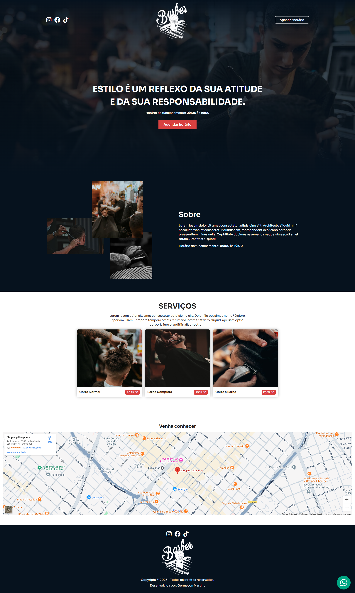

# Project - Barber Dev
 Landing page completa responsiva. Desktop e Mobile.

## Technologies Used in Project

    
    
    
    

## Tools

 

## Access here
<a 
href="https://germeson-martins.github.io/barber-dev/" target="_blank">Link
</a>

